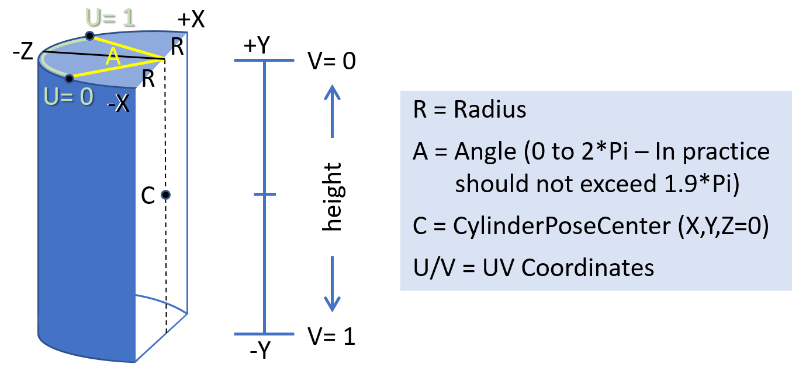

### Layers in WebXR

Current WebXR spec is written with layers in mind (see [XRLayer interface](https://immersive-web.github.io/webxr/#xrlayer-interface)), however, only a single layer ([baseLayer](https://immersive-web.github.io/webxr/#dom-xrrenderstate-baselayer)) is currently supported.

Other XR APIs (such as OpenXR, Oculus PC & Mobile SDKs, more? tbd) support so called 'composition' or 'timewarp' layers.

### Summary

Objects and textures rendered as compositor layers render at the frame rate of the compositor, the refresh rate of the HMD, instead of rendering at the application frame rate. Because of this, the compositor layers are less prone to judder and are raytraced through the lenses, as well as textures / videos are not double sampled and sampled directly by the compositor at full resolution. This improves the clarity of the textures or text displayed on them.

### Example use cases

Compositor layers are useful for displaying information, text, video, or textures that are intended to be focal objects in your scene. Compositor layers can also be useful for displaying simple environments and backgrounds to your scene.

One of the very common use cases of WebXR is 180 and/or 360 photos or videos, both - equirect and cubemaps. Usual implementation involves a lot of CPU and GPU power and the result is usually pretty poor in terms of visual quality, latency and power consumption (the latter is especially critical for mobile / standalone devices, such as Oculus Go, Quest, Vive Focus, ML1, HoloLens, etc).

Another example where compositor layers are going to shine is displaying text or high resolution textures in the virtual world. Since compositor layers allow to sample source texture at full resolution without downsampling to the resolution of the eye buffers (which is usually much lower than the physical resolution of the device's screen(s)) the readability of the text is going to be significantly improved.
I would propose two types of compositor layers for the text - quad and cylinder. While cylinder layer is harder to implement than a simple Quad, it provides much better way to display readable text in VR space. But if the cylinder layer is not supported by the certain hardware or the browser then the Quad layer could be used.

### Implementation overview

A very high-level description of the implementation could be this:
* Replace the XRRenderState [baseLayer](https://immersive-web.github.io/webxr/#dom-xrrenderstate-baselayer) with the sequence of XRLayers;
```webidl
dictionary XRRenderStateInit {
  double depthNear;
  double depthFar;
  sequence<XRLayer>? layers;
};

[SecureContext, Exposed=Window] interface XRRenderState {
  readonly attribute double depthNear;
  readonly attribute double depthFar;
  readonly attribute FrozenArray<XRLayer>? layers;
};
```
Example of use:
```javascript
var quadImage = null;
....
function onXRSessionStarted(xrSession) {
  let glCanvas = document.createElement("canvas");
  let gl = glCanvas.getContext("webgl", { xrCompatible: true });

  quadImage = new XRLayerTextureImage(800, 600);
  let quadPose = new XRRigidTransform({0, 0, -5}, {0, 0, 0, 1});
  let quadSpace = xrSession.requestReferenceSpace({"stationary", "floorLevel"});

  loadWebGLResources();

  xrSession.updateRenderState({ [ 
    new XRWebGLLayer(xrSession, gl), 
    new XRQuadLayer(xrSession, gl, {quadImage, "both", quadSpace, quadPose, 1.0, 1.0} ) ] });
}
```

* Introduce different subtypes to [XRLayer](https://immersive-web.github.io/webxr/#xrlayer-interface) which will have all the necessary attributes for each layer;
* Introduce a way to determine which layers are supported and what is the maximum amount of the layers supported. 
> **TODO** expose capabitilities of layers, in XRSession?

* Layers are drawn in the same order as they are specified in via `XRSession/updateRenderState`, with the
0th layer drawn first. Layers are drawn with a "painter’s algorithm," with each successive layer
potentially overwriting the destination layers whether or not the new layers are virtually closer to the
viewer.

### Proposed types of layers
Not all layers are going to be supported by all hardware/browsers. We would need to figure out the bare minimum of layer types to be supported. I have the following ones in mind: the transparent or opaque quadrilateral, cubemap, cylindrical and equirect layers.

### Changes to XRLayer / XRLayerInit
```webidl
dictionary XRLayerInit {
  boolean chromaticAberration = false;
  boolean blendTextureSourceAlpha = false;
};

[
    SecureContext,
    Exposed=Window,
    Constructor(XRSession session, XRWebGLRenderingContext context, optional XRLayerInit imageInit)
] interface XRLayer {
  readonly attribute boolean chromaticAberration;
  readonly attribute boolean blendTextureSourceAlpha;
  
  void requestUpdate();
};
```
There are certain properties / attributes of layers which are common across all types of the layers. Such common attributes should be declared in base XRLayer and XRLayerInit types:
* `chromaticAberration` - controls chromatic aberration correction on per-layer basis. This would be beneficial for the layers like Quads and Cylinders, especially with the text.
* `blendTextureSourceAlpha` - enables the layer's texture alpha channel; when it is set to `true` then the layer composition uses the alpha channel for the blending of the layer's image against the destination. The image's color channels must be encoded with premultiplied alpha. When the image has no alpha channel then this flag is ignored. If this flag is not set then the image is treated as if each texel is opaque, regardless of the presence of an alpha channel.
The blending opration between the source and destination is an addition. The formula for the blending of each color component is as follows: `destination_color = (source_color + (destination_color * (1 - source_alpha)))`.
> **TODO** Verify with WebGL folks

> **TODO** Any use of `visible` attribute (modifiable at run-time)? Or, just use `XRSession/updateRenderState` if layer's visibility changes?


#### Added methods to XRLayer
* `void requestUpdate()` - the method that should be called to indicate the layer's content changed; by default, browser should assume that the content of the layers (image source) is not updated.
> **TODO** Should we add a way to control layer's visibility or, just use `XRSession/updateRenderState` if layer's visibility changes?

### Layer image source
Layers require image source that is used for the rendering. In order to achieve maximum performance and to avoid extra texture copies, the image sources might be implemented as direct compositor swapchains under-the-hood. The proposed image sources are as follows:
* `XRLayerImageSource` and `XRLayerImageSourceInit` - the base types;
* `XRLayerTextureImage` - the WebGLTexure is exposed, so the content can be copied or rendered into it. This image source can be created using `XRLayerTextureImageInit` object. For `XRCubeLayer` the `cube` flag should be set to `true` at the creation time of the image source.
* `XRLayerTextureArrayImage` - the WebGLTexture, that represents texture array is exposed, so the content can be copied or rendered into layers of it. Layer 0 represents the left eye image, 1 - the right eye image. The `XRLayerTextureArrayImageInit` object is used for creation of this image source.
* `XRLayerFramebufferImage` - the opaque WebGLFramebuffer is exposed, see 'Anti-aliasing' below. The `XRLayerFramebufferImageInit` is used for creation of this image source.
> **TODO** Verify necessity of all of these image sources, or do we need more?

> **TODO** Document all the image sources here

> **TODO** Add all necessary methods to each image source.

> **TODO** Add `XRLayerDOMImage` and `XRLayerVideoImage`

#### Anti-aliasing

Unfortunately, even WebGL 2 has limited functionality in terms of supporting multisampling rendering into a texture. There is no way to render directly into a texture with implicit multisampling (there is no WebGL analog of the `GL_EXT_multisampled_render_to_texture` GL extension). Using multisampled renderbuffers is possible in WebGL 2.0, but it involves extra copying (blitting from the renderbuffer to a texture to explicitly resolve).

To address this performance and compatibility issue, I think to introduce an `XRLayerFramebufferImage`, that will create an opaque framebuffer with multisampling support, similarly to what is used for `XRWebGLLayer`.
> **TODO** Verify with WebGL folks

It also may have the multiview flag.

> **TODO** What are we going to do with multiview? Multiview has the same issue, `WEBGL_multiview` has no way to render into the texture array with anti-aliasing.


#### Stereo vs mono
The Quad, Cylinder, Equirect and Cube layers may be used for rendering either as stereo (when the image is different for each eye) or as mono (when both eyes use the same image). For simplicity reasons, I propose to use similar approach to the OpenXR API, where the layer has `XRLayerEyeVisibility` attribute that can have values `both`, `left` and `right`. This attributes controls which of the viewer's eyes to display the layer to. For mono rendering the `both` should be used. This approach provides 1:1 ratio between the layers and image sources, i.e. there is only one image source per layer, regardless whether it is the "stereo" or "mono" layer.

For rendering stereo content it is necessary to create two layers, one with `left` eye visibility attirbute and another one with the `right` one. Both layers may reference to the same `XRLayerImageSource`, but most likely they should use different `XRLayerSubImage` with different texture rectangle or layer index; the `XRLayerSubImage` type defines which part of the image source should be used for the rendering of the particular eye. It is also possible to use completely different `XRLayerImageSource` per eye: for example, the `XRCubeLayer` should use different image sources for left and right eye, in the case when stereo cube map rendering is wanted.

```webidl
[
    SecureContext,
    Exposed=Window,
    Constructor(XRLayerImageSource imageSource, optional sequence<float> imageRect, optional long arrayIndex)
] interface XRLayerSubImage {
  readonly attribute XRLayerImageSource imageSource;
  readonly attribute FrozenArray<float> imageRectUV; // 2D rect in UV space
  readonly attribute long imageArrayIndex;
};
```

## Layers

### Quad Layer
The quad layer describe a posable planar rectangle in the virtual world for displaying two-dimensional content. The quad layer occupies a certain portion of the display's FOV and allows better match between the resolution of the image source and the footprint of that image in the final composition. This allows optimal sampling and improves clarity of the image, which is important for rendering text or UI elements.

```webidl
dictionary XRQuadLayerInit {
  (XRLayerSubImage or XRLayerImageSource) image;
  XRLayerEyeVisibility eyeVisibility = "both";
  XRSpace              space;
  XRRigidTransform?    pose;
  float                width;
  float                height;
};

[
    SecureContext,
    Exposed=Window,
    Constructor(XRSession session, XRWebGLRenderingContext context, optional XRQuadLayerInit layerInit)
] interface XRQuadLayer : XRLayer {

  readonly attribute XRLayerSubImage      subImage;

  readonly attribute XRLayerEyeVisibility eyeVisibility;
  readonly attribute XRSpace              space;
  readonly attribute XRRigidTransform?    pose;
  readonly attribute float                width;
  readonly attribute float                height;

  XRViewport? getViewport(XRView view);
};
```
The constructor should initialize the `XRQuadLayer` instance accordingly to attributes set in layerInit.

The attributes of the `XRQuadLayer` are as follows:
* `image` - (for `XRQuadLayerInit` only), the instance of `XRLayerImageSource` or `XRLayerSubImage` or any of the inherited types;
* `subImage` - the instance of `XRLayerSubImage` or any of the inherited types; if the `XRLayerImageSource` was provided to inside the `XRQuadLayerInit` object, then it will be converted to `XRLayerSubImage`;
* `eyeVisibility` - the `XRLayerEyeVisibility`, defines which eye(s) this layer is rendered for;
* `space` - the `XRSpace` or inherited type, defines the space in which the `pose` of the quad layer is expressed.
* `pose` - the `XRRigidTransform`, defines position and orientation of the quad in the reference space of the `space`;
* `width` and `height` - the dimensions of the quad.

Only front face of the quad layer is visible; the back face is not visible and **must** not be rendered by the browser. A quad layer has no thickness; it is a 2D object positioned and oriented in 3D space.

The position of the quad refers to the center of the quad within the given `XRSpace`. The orientation of the quad refers to the orientation of the normal vector form the front face.

The dimensions of the quad refer to the quad's size in the xy-plane of the given `XRSpace`'s coordinate system. For example, the quad with the orientation {0,0,0,1}, position {0,0,0}, and dimensions {1,1} refers to 1 meter by 1 meter quad centered at {0,0,0} with its front face normal vector congruent to Z+ axis.

> **TODO** Hittestable / interactive layers with using `XRLayerDOMImage`?

> **TODO** Define proper methods for `XRQuadLayer`, if any


### Cylinder Layer
The cylinder layer is similar to quad layer: it is an object in the world with image mapped onto the inside of a cylinder section. It can be imagined the same way a curved TV set display looks to a viewer. Only the internal surface of the layer **must** be rendered; the exterior of the cylinder is not visible and **must not** be rendered by the browser.
```webidl
dictionary XRCylinderLayerInit {
  (XRLayerSubImage or XRLayerImageSource) image;
  XRLayerEyeVisibility eyeVisibility = "both";
  XRSpace              space;
  XRRigidTransform?    pose;
  float                radius;
  float                centralAngle;
  float                aspectRatio;
};

[
    SecureContext,
    Exposed=Window,
    Constructor(XRSession session, XRWebGLRenderingContext context, optional XRCylinderLayerInit layerInit)
] interface XRCylinderLayer : XRLayer {

  readonly attribute XRLayerSubImage      subImage;

  readonly attribute XRLayerEyeVisibility eyeVisibility;
  readonly attribute XRSpace              space;
  readonly attribute XRRigidTransform?    pose;
  readonly attribute float                radius;
  readonly attribute float                centralAngle;
  readonly attribute float                aspectRatio;

  XRViewport? getViewport(XRView view);
};
```
See `XRQuadLayer` for common attributes' description.

The cylinder-specific attributes are as follows:
* `pose` - the `XRRigidTransform`, defines position and orientation of the center point of the view of the cylinder in the reference space of the `space`;
* `radius` - the radius of the cylinder.
* `centralAngle` - is the angle of the visible section of the cylinder, in radians, from 0 (inclusive) to 2 x PI (exclusive). It grows symmetrically around the 0 radian angle.
* `aspectRatio` - is the aspect ratio of the visible cylinder section, width / height. The height of the cylinder height is calculated as follows: `height = radius * centralAngle) / aspectRatio`.


> **TODO** Update the drawing

> **TODO** Define proper methods for `XRCylinderLayer`, if any

> **TODO** Hittestable / interactive layers with using `XRLayerDOMImage`?


### Equirect Layer
```webidl
dictionary XREquirectLayerInit {
  (XRLayerSubImage or XRLayerImageSource) image;
  XRLayerEyeVisibility eyeVisibility = "both";
  XRSpace              space;
  XRRigidTransform?    pose;

  DOMPoint             scale;  // x,y
  DOMPoint             biasUV; // x,y
};

[
    SecureContext,
    Exposed=Window,
    Constructor(XRSession session, XRWebGLRenderingContext context, optional XREquirectLayerInit layerInit)
] interface XREquirectLayer : XRLayer {

  readonly attribute XRLayerSubImage   subImage;

  readonly attribute XRLayerEyeVisibility eyeVisibility;
  readonly attribute XRSpace           space;
  readonly attribute XRRigidTransform? pose;
  readonly attribute DOMPointReadOnly  scale;  //2f
  readonly attribute DOMPointReadOnly  biasUV; //2f

  XRViewport? getViewport(XRView view);
};
```
> **TODO** Document this layer

> **TODO** Define proper methods for `XREquirectLayer`, if any

### Cubemap Layer
```webidl
dictionary XRCubeLayerInit {
  XRLayerImageSource   image;
  XRLayerEyeVisibility eyeVisibility = "both";
  XRSpace              space;
  DOMPoint             orientation; 
  DOMPoint             offset; 
};

[
    SecureContext,
    Exposed=Window,
    Constructor(XRSession session, XRWebGLRenderingContext context, optional XRCubeLayerInit layerInit)
] interface XRCubeLayer : XRLayer {

  readonly attribute XRLayerImageSource   image;

  readonly attribute XRLayerEyeVisibility eyeVisibility;
  readonly attribute XRSpace              space;

  readonly attribute DOMPointReadOnly     orientation; 
  readonly attribute DOMPointReadOnly     offset; 

  XRViewport? getViewport(XRView view);
};
```
Only `XRLayerTextureImage` with `cube` attribute set to `true` is supported as image source for the `XRCubeLayer`.
> **TODO** Document this layer

> **TODO** Define proper methods for `XRCubeLayer`, if any

## Proposed IDL

```webidl
typedef (WebGLRenderingContext or WebGL2RenderingContext) XRWebGLRenderingContext;

dictionary XRLayerInit {
  boolean chromaticAberration = false;
  boolean blendTextureSourceAlpha = false;
};

[
    SecureContext,
    Exposed=Window,
    Constructor(XRSession session, XRWebGLRenderingContext context, optional XRLayerInit imageInit)
] interface XRLayer {
  readonly attribute boolean chromaticAberration;
  readonly attribute boolean blendTextureSourceAlpha;
  
  void requestUpdate();
};

enum XRLayerEyeVisibility {
  "both",
  "left",
  "right" 
};

[
    SecureContext,
    Exposed=Window
] interface XRLayerImageSource {
};

/////////////////////////
dictionary XRLayerTextureImageInit {
  unsigned long textureWidth;
  unsigned long textureHeight;
  boolean alpha = true;
  boolean cube = false;
};

[
    SecureContext,
    Exposed=Window,
    Constructor(XRSession session, XRWebGLRenderingContext context, optional XRLayerTextureImageInit imageInit)
] interface XRLayerTextureImage : XRLayerImageSource {
  readonly attribute XRWebGLRenderingContext context;
  readonly attribute unsigned long textureWidth;
  readonly attribute unsigned long textureHeight;
  readonly attribute unsigned long textureInternalFormat;
  readonly attribute WebGLTexture texture;
  readonly attribute boolean cube;
};

/////////////////////////
dictionary XRLayerTextureArrayImageInit {
  boolean antialias = true;
  unsigned long arrayTextureWidth;
  unsigned long arrayTextureHeight;
  unsigned long arrayTextureDepth;
  boolean alpha = true;
};

[
    SecureContext,
    Exposed=Window,
    Constructor(XRSession session, XRWebGLRenderingContext context, optional XRLayerTextureArrayImageInit imageInit)
] interface XRLayerTextureArrayImage : XRLayerImageSource {
  readonly attribute XRWebGLRenderingContext context;
  readonly attribute unsigned long arrayTextureWidth;
  readonly attribute unsigned long arrayTextureHeight;
  readonly attribute unsigned long arrayTextureDepth;
  readonly attribute unsigned long arrayTextureInternalFormat;
  readonly attribute WebGLTexture arrayTexture;
};

/////////////////////////
dictionary XRLayerFramebufferImageInit {
  boolean antialias = true;
  boolean depth = true;
  boolean stencil = false;
  boolean alpha = true;
  boolean multiview = false;
  unsigned long framebufferWidth;
  unsigned long framebufferHeight;
};

[
    SecureContext,
    Exposed=Window,
    Constructor(XRSession session, XRWebGLRenderingContext context, optional XRLayerFramebufferImageInit imageInit)
] interface XRLayerFramebufferImage : XRLayerImageSource {
  readonly attribute XRWebGLRenderingContext context;
  readonly attribute boolean antialias;
  readonly attribute boolean depth;
  readonly attribute boolean stencil;
  readonly attribute boolean alpha;
  readonly attribute boolean multiview;

  readonly attribute unsigned long framebufferWidth;
  readonly attribute unsigned long framebufferHeight;
  readonly attribute WebGLFramebuffer framebuffer;
};

/////////////////////////
dictionary XRLayerDOMImageInit {
  DOMString     url;
  unsigned long width  = 0;
  unsigned long height = 0;
};

[
    SecureContext,
    Exposed=Window,
    Constructor(XRSession session, XRWebGLRenderingContext context, optional XRLayerDOMImageInit imageInit)
] interface XRLayerDOMSource : XRLayerImageSource {
  readonly attribute DOMString     url;
  readonly attribute unsigned long width;
  readonly attribute unsigned long height;
};

/////////////////////////
dictionary XRLayerVideoSourceInit {
  HTMLVideoElement video;
};


[
    SecureContext,
    Exposed=Window,
    Constructor(XRSession session, XRWebGLRenderingContext context, optional XRLayerVideoSourceInit imageInit)
] interface XRLayerVideoSource : XRLayerImageSource {
  HTMLVideoElement video;
};

//////////////////////////
[
    SecureContext,
    Exposed=Window,
    Constructor(XRLayerImageSource imageSource, optional sequence<float> imageRect, optional long arrayIndex)
] interface XRLayerSubImage {
  readonly attribute XRLayerImageSource imageSource;
  readonly attribute FrozenArray<float> imageRectUV; // 2D rect in UV space
  readonly attribute long imageArrayIndex;
};

/////////////////////////
dictionary XRQuadLayerInit {
  (XRLayerSubImage or XRLayerImageSource) image;
  XRLayerEyeVisibility eyeVisibility = "both";
  XRSpace              space;
  XRRigidTransform?    pose;
  float                width;
  float                height;
};

[
    SecureContext,
    Exposed=Window,
    Constructor(XRSession session, XRWebGLRenderingContext context, optional XRQuadLayerInit layerInit)
] interface XRQuadLayer : XRLayer {

  readonly attribute XRLayerSubImage      subImage;

  readonly attribute XRLayerEyeVisibility eyeVisibility;
  readonly attribute XRSpace              space;
  readonly attribute XRRigidTransform?    pose;
  readonly attribute float                width;
  readonly attribute float                height;

  XRViewport? getViewport(XRView view);
};


/////////////////////////
dictionary XRCylinderLayerInit {
  (XRLayerSubImage or XRLayerImageSource) image;
  XRLayerEyeVisibility eyeVisibility = "both";
  XRSpace              space;
  XRRigidTransform?    pose;
  float                radius;
  float                centralAngle;
  float                aspectRatio;
};

[
    SecureContext,
    Exposed=Window,
    Constructor(XRSession session, XRWebGLRenderingContext context, optional XRCylinderLayerInit layerInit)
] interface XRCylinderLayer : XRLayer {

  readonly attribute XRLayerSubImage      subImage;

  readonly attribute XRLayerEyeVisibility eyeVisibility;
  readonly attribute XRSpace              space;
  readonly attribute XRRigidTransform?    pose;
  readonly attribute float                radius;
  readonly attribute float                centralAngle;
  readonly attribute float                aspectRatio;

  XRViewport? getViewport(XRView view);
};

/////////////////////////
dictionary XREquirectLayerInit {
  (XRLayerSubImage or XRLayerImageSource) image;
  XRLayerEyeVisibility eyeVisibility = "both";
  XRSpace              space;
  XRRigidTransform?    pose;

  DOMPoint             scale;  // x,y
  DOMPoint             biasUV; // x,y
};

[
    SecureContext,
    Exposed=Window,
    Constructor(XRSession session, XRWebGLRenderingContext context, optional XREquirectLayerInit layerInit)
] interface XREquirectLayer : XRLayer {

  readonly attribute XRLayerSubImage   subImage;

  readonly attribute XRLayerEyeVisibility eyeVisibility;
  readonly attribute XRSpace           space;
  readonly attribute XRRigidTransform? pose;
  readonly attribute DOMPointReadOnly  scale;  //2f
  readonly attribute DOMPointReadOnly  biasUV; //2f

  XRViewport? getViewport(XRView view);
};

/////////////////////////
dictionary XRCubeLayerInit {
  XRLayerImageSource   image;
  XRLayerEyeVisibility eyeVisibility = "both";
  XRSpace              space;
  DOMPoint             orientation; 
  DOMPoint             offset; 
};

[
    SecureContext,
    Exposed=Window,
    Constructor(XRSession session, XRWebGLRenderingContext context, optional XRCubeLayerInit layerInit)
] interface XRCubeLayer : XRLayer {

  readonly attribute XRLayerImageSource   image;

  readonly attribute XRLayerEyeVisibility eyeVisibility;
  readonly attribute XRSpace              space;

  readonly attribute DOMPointReadOnly     orientation; 
  readonly attribute DOMPointReadOnly     offset; 

  XRViewport? getViewport(XRView view);
};
```
 
### An extra mile: modify XRWebGLLayer?
> **TODO** Revise

Having XRLayerSourceImage concept introduced, shouldn't we modify XRWebGLLayer to use it instead of explicit reference to framebuffer or texture array (for the XRWebGLArrayLayer)? We could avoid introducing an extra XRWebGLArrayLayer type in this case.
```webidl
dictionary XRWebGLLayerInit {
  boolean antialias = true;
  boolean depth = true;
  boolean stencil = false;
  boolean alpha = true;
  boolean multiview = false;
  double framebufferScaleFactor = 1.0;
};

dictionary XRWebGLArrayLayerInit {
  boolean alpha = true;
  double arrayTextureScaleFactor; // Same as the framebufferScaleFactor
};

[
    SecureContext,
    Exposed=Window,
    Constructor(XRSession session, XRWebGLRenderingContext context, optional XRWebGLLayerInit layerInit),
    Constructor(XRSession session, WebGL2RenderingContext context,  optional XRWebGLArrayLayerInit layerInit)
] interface XRWebGLLayer : XRLayer {
  readonly attribute XRWebGLRenderingContext context;
  readonly attribute XRLayerSourceImage imageSource;

  XRViewport? getViewport(XRView view);
  void requestViewportScaling(double viewportScaleFactor);

  static double getNativeFramebufferScaleFactor(XRSession session);
};
```


